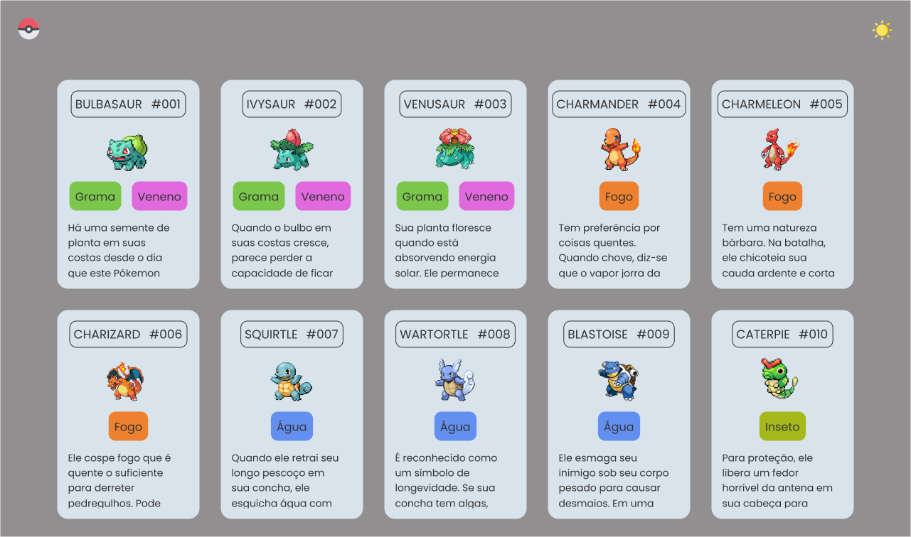

<h1 align="center">Listagem Pokémon</h1>

<p align="center">
  <a href="#-tecnologias">Tecnologias</a>&nbsp;&nbsp;&nbsp;|&nbsp;&nbsp;&nbsp;
  <a href="#-projeto">Projeto</a>&nbsp;&nbsp;&nbsp;|&nbsp;&nbsp;&nbsp;
  <a href="#-layout">Layout</a>&nbsp;&nbsp;&nbsp;|&nbsp;&nbsp;&nbsp;
  <a href="#memo-licença">Licença</a>&nbsp;&nbsp;&nbsp;|&nbsp;&nbsp;&nbsp;
  <a href="#uso">Uso</a>
</p>

<p align="center">
  
</p>

<br>

<p align="center">
  
</p>

## 🚀 Tecnologias

Esse projeto foi desenvolvido com as seguintes tecnologias:

- HTML
- CSS
- JavaScript

## 💻 Projeto

O projeto basicamente é uma listagem de varios pokémons com suas informações com gifs de cada.

- Clicando na imagem do sol no canto superior a direita é possivel alterar o tema da página via DOM

- [Visite o projeto online](https://szpc-pokemon.vercel.app)

## 🔖 Layout

Você pode visualizar o layout do projeto através [DESSE LINK](https://www.figma.com/file/e75zi3kEp6PA98jAg5hCsu/Listagem-Pokemon?type=design&node-id=0%3A1&t=TR9FobTHfXKeG1F8-1). É necessário ter conta no [Figma](https://figma.com) para acessá-lo.

## :memo: Licença

Esse projeto está sob a licença MIT.

## 🛠 Como rodar a aplicação

```bash
# clonar o repositório

# por HTTPS
$ git clone https://github.com/pedrodev30/szpc-pokemon.git

# por chave SSH
$ git clone git@github.com:pedrodev30/szpc-pokemon.git

# vai entrar na pasta do projeto
$ cd na pasta projeto

# abrir a pasta do projeto no seu editor
$ Abra a pasta no Visual Studio Code ou editor de sua Preferência

# Live Server é uma extensão do Vs Code que executa o arquivo no seu navegador
$ Agora abra o arquivo index.html com o live Server
```

---

<p align="center">
  Feito com ♥ por Pedro Henrique
</p>